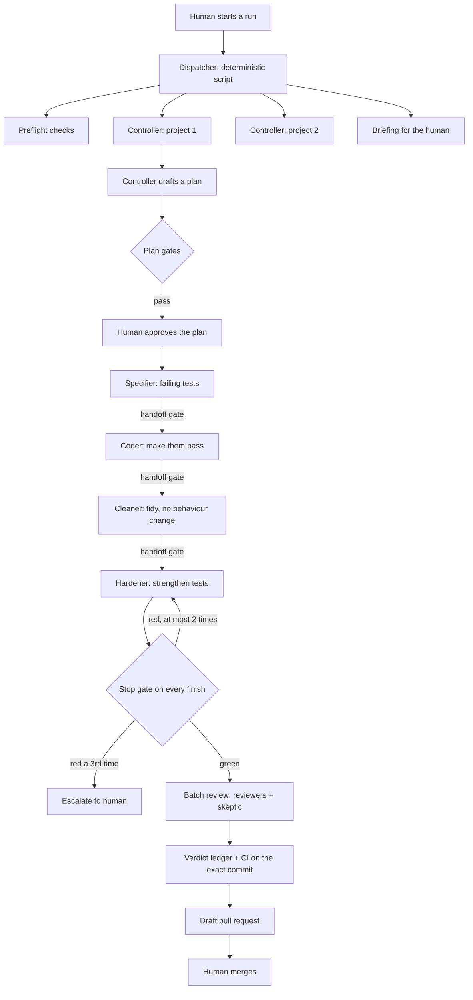

# Flow and roles

## The shape

The stop gate is drawn once but fires for **every** role: each role has its own set of gates
that must be green before it may finish.

## A run, step by step

1. **The human starts a run** with one command. A run ends when the queue is empty, the budget
   is spent, or a usage limit stops it. (A schedule can be added later without changing the
   design.)
2. **Preflight** (script, fails closed): credentials present, tools installed, project paths
   exist, working copies clean, dependencies installed. A failure stops that project with a
   reason in the briefing.
3. **Read the human's decisions** from the last briefing: approved plans become buildable,
   rejected plans go back with the human's note, accepted lessons are applied, accepted
   proposals become tickets.
4. **Fill slots:** at most a fixed number of controllers run at once (2 in the reference build).
5. **Each controller** handles a small, fixed number of tickets per run (2 in the reference
   build).
6. **When all controllers are done:** analyse the run's observations into lessons, then write the
   briefing.

On a usage-limit error: clean stop, the ticket goes back to the queue, and the run resumes after
the limit resets if it is still running.

## Ticket states

`ready-for-agent → planned → claimed → ready-for-review → done`

| Transition | Who | Tier |
|---|---|---|
| ready-for-agent → planned | Controller drafts a plan; the human approves it | 2 |
| planned → claimed | Controller, written before work starts | 3 |
| claimed → ready-for-review | Controller, after review and the ledger entry | 3 |
| claimed → planned | Controller, when a ticket is abandoned or escalated, with a report | 3 |
| ready-for-review → done | The human only | 4 |

## Roles

No role grades its own work, and each role **owns one set of gates**. Roles are short-lived:
each gets a fresh context, does one job and hands off. This keeps context small, which matters
even more on a local model.

| Role | Does | Must not | Owns the gate(s) |
|---|---|---|---|
| **Dispatcher** | Starts and supervises a run: preflight, slots, queue, caps, retries, watchers, the briefing. A plain script, no model | Make judgement calls | Preflight, concurrency cap, retry table, budget, verdict ledger, PR state machine |
| **Controller** | One per project. Picks work, drafts plans, writes each role's brief, routes handoffs, decides on escalation | Write code | Plan gates (before a plan reaches the human) |
| **Specifier** | Turns the plan's behaviour list into failing tests, in a new-tests area only | Write production code | **Red check**: the new tests must fail on the code before the change |
| **Coder** | Makes those tests pass, test-first, one behaviour at a time | Delete or weaken tests | Four checks (lint, typecheck, tests, build) + test-deletion guard |
| **Cleaner** | Refactors the change without changing behaviour; edits production code only | Change tests or behaviour | Four checks, test-deletion, duplication, import boundaries |
| **Hardener** | Adds tests until every mutant on the touched code is killed; adds property tests on pure modules | Change production code | Four checks, test-deletion, test strength (complexity-times-coverage score and mutation) |
| **Reviewers** | Read-only, fresh context each. Two axes: *standards* (code quality) and *spec* (does it do what the ticket says). One reviewer should be a **different model family** | Edit anything | Review schema (output must match a strict JSON shape) |
| **Skeptic** | Read-only. Tries to refute one high-severity finding with evidence | Edit anything | Refutation shape; unreadable output = not refuted |

## Handoffs

What passes between steps is always a **file or a commit**, never the conversation.

| From → to | What is handed over | Checked by |
|---|---|---|
| Human → controller | Ticket with acceptance criteria; standing project directives | Plan gates read both |
| Controller → human | Plan file (fixed sections, behaviour list with real test code and the expected failure of each, criteria-to-behaviour map, risks, needs-human) | Plan gates |
| Controller → role | A brief with nine fields: goal, scope, context, acceptance, verify, timebox, forbidden, report, standing orders; plus the project directives | (template) |
| Role → role | A handoff draft: type, recipient, priority, task name, commit (or a one-line note) | **Handoff gate**: the gate, not the agent, writes the final handoff file |
| Role → controller | A three-line report for the briefing; the gate JSON results | Stop gate |
| Reviewer → controller | One JSON object `{findings: [...]}` | Review schema gate |
| Skeptic → controller | `{refuted: boolean, evidence: string}` | Refutation check |
| Controller → human | Draft pull request; ledger entry for the exact commit; briefing | CI-on-commit gate, ledger |

Agents never write the canonical handoff file themselves: they write a small draft, and the
handoff gate validates it and generates the identifiers, timestamps and full commit hash.

## Review, in order

1. **Pre-flight:** pin the merge-base; fail early on a bad reference or an empty diff.
2. **Reviewers in parallel**, fresh context, read-only. If the second model family is
   unavailable, a stand-in reviewer from the main family takes its place and the briefing says
   so.
3. **Schema gate** on each reviewer's output. A crashed reviewer counts as blocking.
4. **Skeptic** on each high or critical finding. Findings that are not refuted block.
5. **Triage:** fix, decline with a reason, or escalate. At most 2 fix rounds, each through the
   stop gate again.
6. **Commit, ledger, pull request:** record the verdict for the exact commit, push a feature
   branch, open a **draft** pull request, and require CI green on that commit.

Whether review runs inside every run or only on request is a per-project choice
(to confirm after the pilot).

## Optional extras in the reference build

These depend on the projects and hosting involved; treat them as patterns, not requirements.

- **Incident watcher:** a script loop that polls hosting and database status during a run and
  files incidents into the queue. One written exception to "reads free, writes ask": an
  automatic rollback of the production deployment to the previous one, only when a code rule
  with fixed thresholds fires (error count and rate, compared with the previous deploy), at most
  once per 24 hours, always logged and reported.
- **Upstream watcher:** weekly, compare a list of public upstream repositories against their
  last-seen commit; no change means no model call. Changes are classified (new gate, changed
  gate, flow idea, irrelevant) and the top few become tier-2 proposals. Never applied
  automatically; a licence check runs before anything is borrowed.
